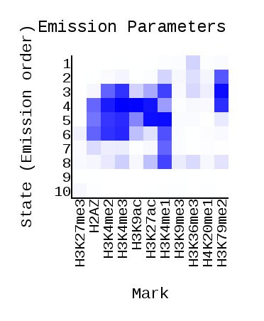
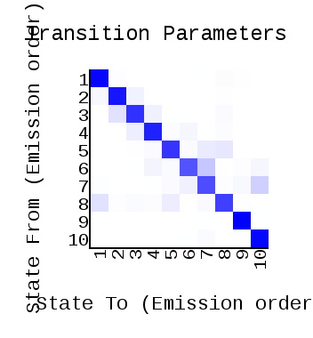
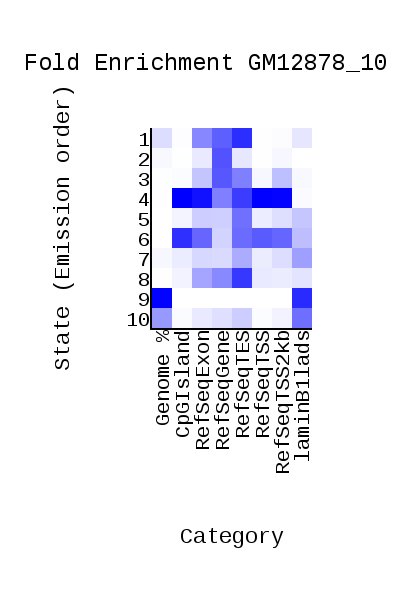

# hse_hw3_chromhmm

Клеточная линия в задании ChIP-seq: GM23338

Среди доступных на https://genome.ucsc.edu/ENCODE/dataMatrix/encodeChipMatrixHuman.html клеточных линий GM23338 нет, поэтому для работы выбрана линия GM12878.

Клеточная линия: GM12878

Гистоновые метки:

| Histone modification | tableName | File |
| - | - | - |
| H2AZ | wgEncodeBroadHistoneGm12878H2az | wgEncodeBroadHistoneGm12878H2azStdAlnRep1.bam |
| H3K27ac | wgEncodeBroadHistoneGm12878H3k27ac | wgEncodeBroadHistoneGm12878H3k27acStdAlnRep1.bam |
| H3K27me3 | wgEncodeBroadHistoneGm12878H3k27me3 | wgEncodeBroadHistoneGm12878H3k27me3StdAlnRep1.bam |
| H3K36me3 | wgEncodeBroadHistoneGm12878H3k36me3 | wgEncodeBroadHistoneGm12878H3k36me3StdAlnRep1.bam |
| H3K4me1 | wgEncodeBroadHistoneGm12878H3k04me1 | wgEncodeBroadHistoneGm12878H3k04me1StdAlnRep1V2.bam |
| H3K4me2 | wgEncodeBroadHistoneGm12878H3k4me2 | wgEncodeBroadHistoneGm12878H3k4me2StdAlnRep1.bam |
| H3K4me3 | wgEncodeBroadHistoneGm12878H3k04me3 | wgEncodeBroadHistoneGm12878H3k04me3StdAlnRep2V2.bam |
| H3K79me2 | wgEncodeBroadHistoneGm12878H3k79me2 | wgEncodeBroadHistoneGm12878H3k79me2StdAlnRep1.bam |
| H3K9ac | wgEncodeBroadHistoneGm12878H3k9ac | wgEncodeBroadHistoneGm12878H3k9acStdAlnRep1.bam |
| H3K9me3 | wgEncodeBroadHistoneGm12878H3k9me3 | wgEncodeBroadHistoneGm12878H3k9me3StdAlnRep1.bam |
| H4K20me1 | wgEncodeBroadHistoneGm12878H4k20me1 | wgEncodeBroadHistoneGm12878H4k20me1StdAlnRep1.bam |

Контроль:
| Control | tableName | File |
| - | - | - |
| Control | wgEncodeBroadHistoneGm12878Control | wgEncodeBroadHistoneGm12878ControlStdAlnRep1.bam |

## ChromHMM
Вручную создан текстовый файл cellmarkfiletable.txt, в котором указаны тип клеток, гистоновые метки, а также соответствующие .bam файлы для эксперимента и контроля. Файл загружен в папку data.

Запустили ChromHMM.

https://colab.research.google.com/drive/1V4Mug6eBHqznC5aqzryAyFwoze8w9Bqv?usp=sharing

Файлы (20 файлов), выданные ChromHMM, загружены в папку data.

Emission Parameters | Transition Parameters | Fold Enrichment GM12878_10
-|-|-
 |  | 

## UCSC Genome Browser
Настроен Custom Track с dense.bed файлом из выдачи ChromHMM.

chr10:89,281-204,480

chr10:198,721-313,920

chr10:308,161-423,360

chr10:417,601-532,800

chr10:527,041-642,240

Список файлов для сдачи
В репозитории в файле README.md:
Табличка с номерами эпигенетических типов, их характерные эпигенетические метки и другие свойства, а также присвоенные им названия
Список всех запущенных команд
Результат бонусного задания (если есть)
